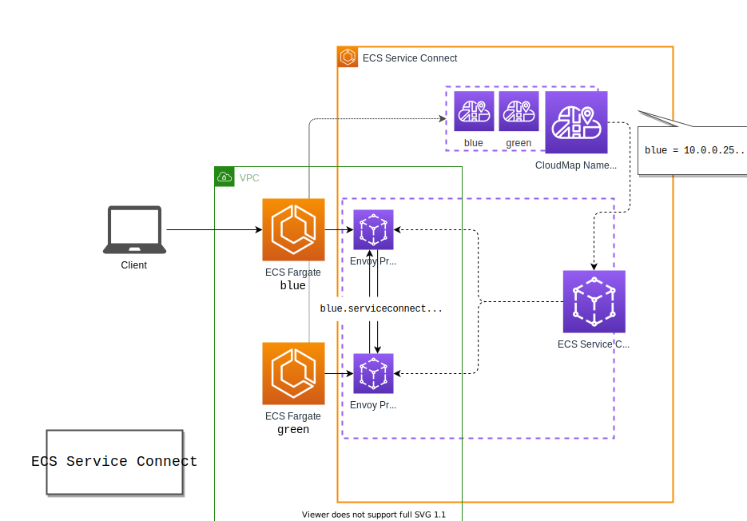
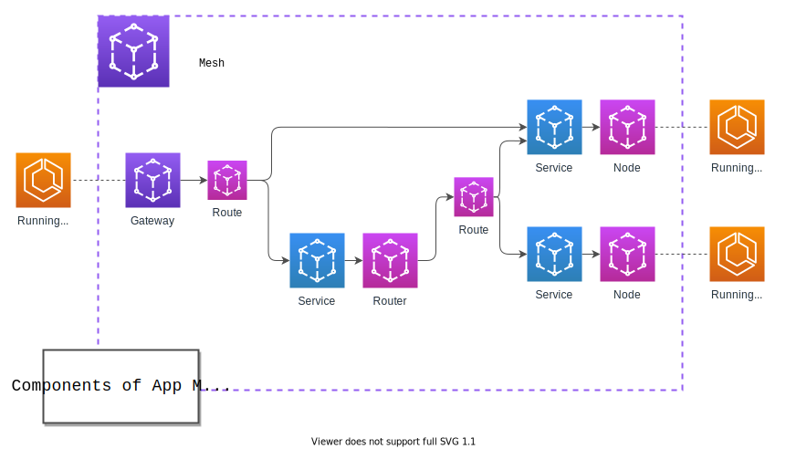
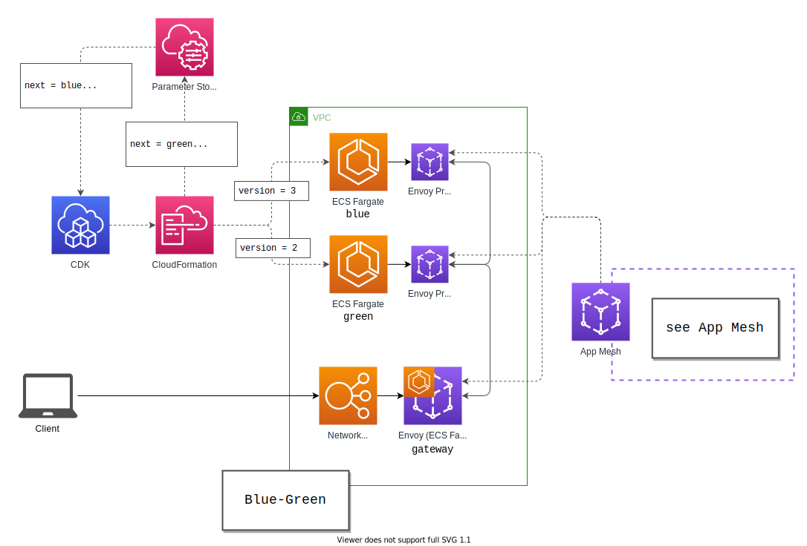

# ECS Service Connect and App Mesh

This repository explores the experience of using the AWS CDK to administer ECS Service Connect and App Mesh.

## Setup

Install dependencies

```
yarn install
```

Prepare your terminal session with AWS credentials for use with AWS CDK

```
# Personally I use aws-vault, configure your terminal using your workflow
aws-vault exec my-cool-aws-profile
```

[Find your public IP](https://www.google.com/search?q=whats+my+ip) and update `externalAccess` in [`ip.ts`](./lib/ip.ts):

```
export const externalAccess = Peer.ipv4("1.2.3.4/32");
```

## Express.js App

This repo includes a simple Express.js [application](./expressjs/lib/app.ts) that is run on ECS Fargate to demonstrate ECS Service Connect and App Mesh.

It has the following endpoints:
- `GET /`: status endpoint that responds with JSON specifying the `service` and `version` that have been configured by environment
  ```
  GET /

  {"message":"ok","service":"green","version":"1"}
  ```
- `GET /downstream/:service`: fetches a downstream request to `service` and responds with the result
  ```
  GET /downstream/other-service

  {"message":"fetched!","service":"green","response":{"message":"ok","service":"other-service","version":"unknown"}}
  ```

You can run the application locally to understand it better:
```
❯ cd expressjs
❯ yarn install
❯ SERVICE_NAME=testing SERVICE_VERSION=10 yarn start                                                                           
yarn run v1.22.15
$ ts-node bin/serve.ts
Service 'testing' (version 10) running on port: 3000
```

## ECS Service Connect

[ECS Service Connect](https://aws.amazon.com/blogs/aws/new-amazon-ecs-service-connect-enabling-easy-communication-between-microservices/) provides an out-of-the-box service discovery method for services running in ECS.

In essence, for developer in connect their service to a "namespace" they just need to:
- configure the ECS Service Connect namespace when they set up an ECS Cluster
- provide some additional discovery config to their ECS Task Definitions

Under the hood, my investigation leads me to believe that ECS Service Connect configures and manages App Mesh for you. With App Mesh the Envoy _control plane_ is managed and the developer is expected to manage the Envoy _data plane_ by configuring proxy sidecars in their services, but ECS Service Connect uses the new discovery config to configure and inject the Envoy data plane _as well_. Below is a sample startup log line from the proxy container in an ECS Service Connect-configured service that indicates that the provided proxy container is connecting to an AWS-managed App Mesh:

```
time="2022-12-10T11:24:48Z" level=info msg="App Mesh Environment Variables: [APPMESH_XDS_ENDPOINT=unix:///var/run/ecs/appnet/relay/appnet_relay_listener.sock APPMESH_METRIC_EXTENSION_VERSION=1 APPMESH_RESOURCE_ARN=arn:aws:ecs:ap-southeast-2:933397847440:task-set/tomwrightmesh-cluster/tomwrightmesh-ServiceAService01F8F99F-QP8c9w6ArTf1/ecs-svc/2740018079984326164]"
```

### Exploring ECS Service Connect with AWS CDK

Check out [`serviceconnect.ts`](./lib/serviceconnect.ts) to see the implementation of the ECS Service Connect architecture. The configuration of components is minimal, primarily just "wiring things up".



Deploy our `serviceconnect` example:

```
yarn cdk:serviceconnect deploy
```

Open up the AWS Console > Navigate to ECS > `serviceconnect` ECS Cluster > Find `green` service > Find running task > Get Public IP of task

Connect to the service in your browser:

```
http://<ip>/

{"message":"ok","service":"green","version":"unknown"}
```

Our services are able to discovery and intercommunicate through the Envoy proxy that has been configured and added by ECS Service Connect. Connect to “downstream” `blue` service from `green` service via ECS Service Connect (service discovery name `blue` in namespace `serviceconnect` = `blue.serviceconnect`)

```
http://<ip>/downstream/blue.serviceconnect

{"message":"fetched!","service":"green","response":{"message":"ok","service":"blue","version":"unknown"}}
```

Clean up the resources used for our `serviceconnect` example:

```
yarn cdk:serviceconnect destroy
```

The Cloud Map namespace created by ECS Service Connect is **not automatically deleted** so clean that up manually. AWS Console > Cloud Map service > `serviceconnect` namespace > Delete

### What did we learn?

ECS Service Connect allows us to enable service discovery between our ECS Services. To do so, we only need to add configuration to our ECS Clusters, Task Definitions and Services.

This service discovery by ECS Service Connect:
- could replace internal load balancers between our services, eliminating those costs.
- produces additional networking telemetry, providing us more observability in our traffic
 
However, the App Mesh managed internally by ECS Service Connect is not accessible by us for additional configuration. This prevents us from leveraging the more advanced features of an Envoy service mesh:
- complex routing and load balancing based on paths or headers

The limited feature set and lack of extensibility of ECS Service Connect makes it less suitable for complex architectures.

## App Mesh

[AWS App Mesh](https://docs.aws.amazon.com/app-mesh/latest/userguide/what-is-app-mesh.html) provides a managed service mesh control plane based on [Envoy](https://www.envoyproxy.io/) proxy. The service mesh has integrations with Cloud Map and Route 53 for service discovery. The App Mesh components of the service mesh can be managed by AWS APIs, CloudFormation, and AWS CDK.

Developers are expected to add and configure a proxy sidecar container (the Envoy _data plane_) to their ECS Services. This proxy connects to the App Mesh _control plane_ and receives routing information about the logical components of the mesh. The proxy then uses service discovery via Cloud Map or Route 53 to populate the real network destinations and send traffic.



Understanding how the App Mesh components fit together can be confusing. Hopefully this diagram and table helps describe how the logical components of an App Mesh mesh relate to actual running services on the network.

| Component       | Description                            | Connects to              | Is backed by running service |
| --------------- | -------------------------------------- | ------------------------ | ---------------------------- |
| Virtual Gateway | Receives traffic from outside the mesh | Virtual Routes           | Yes                          |
| Virtual Route   | Directs traffic to services            | Virtual Services         | No                           |
| Virtual Service | Destination of traffic in a mesh       | Virtual Nodes or Routers | No                           |
| Virtual Router  | Directs traffic to route               | Virtual Routes           | No                           |
| Virtual Node    | Responds to and consumes traffic       | Virtual Services         | Yes                          |


### Exploring App Mesh with AWS CDK

Configuring App Mesh ourselves is significantly more complex than with ECS Service Connect. Check out [`appmesh.ts`](./lib/appmesh.ts) to see the implementation of the below App Mesh architecture.

#### HTTP-Only vs Private DNS Cloud Map namespace

Despite the fact that the Envoy proxy will handle routing traffic as per service discovery, the running service (that knows nothing about Envoy being present) still needs to be able to resolve each DNS name (e.g. `blue.appmesh`) and attempt to send it _somewhere_ for it to be intercepted by the Envoy proxy. This situation is described in [this troubleshooting guide](https://docs.aws.amazon.com/app-mesh/latest/userguide/troubleshooting-connectivity.html).

In this example implementation the easiest way to make sure this works (and also to provide better interoperability with resources outside the service mesh) is to configure the Cloud Map namespace as a Private DNS one so that Route 53 records are published when services are registered.

However, ECS Service Connect doesn't do this, and uses only an HTTP-Only Cloud Map namespace (service addresses are only stored in Cloud Map and not published to Route 53). This should mean that running service in ECS is unable to resolve the DNS name of the service but that doesn't seem to be the case.

_[?] Haven't gotten to the bottom of this one yet [?]_


Deploy our `appmesh` example:

```
yarn cdk:appmesh deploy
```

Open up the AWS Console > Navigate to ECS > `appmesh` ECS Cluster > Find `green` service > Find running task > Get Public IP of task

Connect to the service in your browser:

```
http://<ip>/

{"message":"ok","service":"green","version":"unknown"}
```

Our services are able to discovery and intercommunicate through the Envoy proxy that has been configured and added by App Mesh. Connect to “downstream” `blue` service from `green` service via App Mesh (service discovery name `blue` in namespace `appmesh` = `blue.appmesh`)

```
http://<ip>/downstream/blue.appmesh

{"message":"fetched!","service":"green","response":{"message":"ok","service":"blue","version":"unknown"}}
```

This is all the same as before. Now for something a little different: In the CloudFormation Outputs of the `appmesh` stack, locate the hostname of our gateway load balancer and explore connecting to services via the "front door":

```
http://appme-meshg-xxxx-xxxx.elb.ap-southeast-2.amazonaws.com/blue

{"message":"ok","service":"blue","version":"unknown"}

http://appme-meshg-xxxx-xxxx.elb.ap-southeast-2.amazonaws.com/green

{"message":"ok","service":"green","version":"unknown"}
```

Now try using our `/split` route that is internally load balanced between our `blue` and `green` services by the service mesh. Keep in mind there is no load balancer involved in this routing, the Envoy gateway is routing based on the configuration provided by the App Mesh control plane.

```
http://appme-meshg-xxxx-xxxx.elb.ap-southeast-2.amazonaws.com/split

{"message":"ok","service":"blue","version":"unknown"}
{"message":"ok","service":"green","version":"unknown"}
{"message":"ok","service":"green","version":"unknown"}
{"message":"ok","service":"blue","version":"unknown"}
```

We can still traverse the service mesh to `blue` using our `/downstream` route on our Express.js application:

```

http://appme-meshg-xxxx-xxxx.elb.ap-southeast-2.amazonaws.com/split/downstream/blue.app

gateway > blue > blue
gateway > green > blue

{"message":"fetched!","service":"green","response":{"message":"ok","service":"blue","version":"unknown"}}
{"message":"fetched!","service":"blue","response":{"message":"ok","service":"blue","version":"unknown"}}
{"message":"fetched!","service":"blue","response":{"message":"ok","service":"blue","version":"unknown"}}
```
### What did we learn?

Configuring App Mesh requires complex boilerplate. AWS CDK can help us abstract away through Constructs.

Having control over the App Mesh service mesh allows us to configure flexible routing behaviour within the service mesh without the need for load balancers.

## Blue-Green deployments using stateful AWS CDK

This one is just a bonus -- an idea I stumbled on while writing the CDK code for this investigation.

Blue-Green deployments with AWS CDK are difficult to implement because blue-green inherently has state involved -- which stack is current and which one should I update next?

This proof-of-concept solves this using state maintained in AWS Parameter Store. The AWS CDK retrieves this state and applies logic on it to perform the synth, and then the deployment handles updating this state as part of the deployment.

Explore the code for the blue-green architecture below starting from [`bluegreen.ts`](./bin/bluegreen.ts). The ECS and App Mesh portions of this implementation are derived from the `appmesh` example above so refer there if anything is unclear.



Deploy our example `bluegreen` infrastructure:

```
yarn cdk:bluegreen deploy
```

Retrieve the load balancer hostname from output of CloudFormation stack and use that to connect, refresh a few times to see load balancing. Both `blue` and `green` have had an initial deployment of `version: 1`:

```
http://appme-meshg-xxxx-xxxx.elb.ap-southeast-2.amazonaws.com

{"message":"ok","service":"blue","version":"1"}
{"message":"ok","service":"green","version":"1"}
```

Run the included client script to collect request counts against the blue-green setup using `yarn start <hostname>`

```
❯ yarn start blueg-meshg-xxxx-xxxx.elb.ap-southeast-2.amazonaws.com 
yarn run v1.22.15
$ ts-node bin/client.ts blueg-meshg-xxxx-xxxx.elb.ap-southeast-2.amazonaws.com
Running against http://blueg-meshg-xxxx-xxxx.elb.ap-southeast-2.amazonaws.com
200 OK green:1=1
200 OK blue:1=1 green:1=1
200 OK blue:1=1 green:1=2
200 OK blue:1=1 green:1=3
...
```

Update [`bluegreen.ts`](./lib/bluegreen.ts) to bump the version to `2`. Inspect the `cdk diff` to see that only `green` is bumping to `version: 2` and the Parameter Store state is being updated to reflect that:

```
❯ yarn cdk:bluegreen diff                                                               
yarn run v1.22.15
$ cdk --app "yarn ts-node bin/bluegreen.ts" diff
$ /Users/tomwright/Projects/_cultureamp/meshtest/node_modules/.bin/ts-node bin/bluegreen.ts
Stack bluegreen/bluegreen
Resources
[~] AWS::SSM::Parameter bluegreen/Deploy/StateParameter DeployStateParameter8F1DC08B 
 └─ [~] Value
     ├─ [-] {"nextUpdate":"blue","currentVersion":1,"nextVersion":1}
     └─ [+] {"nextUpdate":"green","nextVersion":2,"currentVersion":1}
[~] AWS::ECS::TaskDefinition bluegreen/Deploy/Green/Service/TaskDefinition DeployGreenServiceTaskDefinition773C6E41 replace
 └─ [~] ContainerDefinitions (requires replacement)
     └─ @@ -20,7 +20,7 @@
        [ ]   },
        [ ]   {
        [ ]     "Name": "SERVICE_VERSION",
        [-]     "Value": "1"
        [+]     "Value": "2"
        [ ]   }
        [ ] ],
        [ ] "Essential": true,
```

Run the deployment:

```
yarn cdk:bluegreen deploy
```

Watch the stats from the client script and wait for requests from `green:2` to appear:

```
200 OK blue:1=74 green:1=76
200 OK blue:1=75 green:1=76
200 OK blue:1=76 green:1=76
200 OK blue:1=77 green:1=76
200 OK blue:1=78 green:1=76
200 OK blue:1=78 green:1=76 green:2=1   <-- new version appears running in green
200 OK blue:1=78 green:1=76 green:2=2
200 OK blue:1=79 green:1=76 green:2=2
200 OK blue:1=79 green:1=77 green:2=2  
200 OK blue:1=80 green:1=77 green:2=2
200 OK blue:1=81 green:1=77 green:2=2   <--- green:1 no longer receiving requests
```

Update again to `version: 3` and `cdk diff` to see that now now `blue` has been updated for deployment:

```
❯ yarn cdk:bluegreen diff                                                              
yarn run v1.22.15
$ cdk --app "yarn ts-node bin/bluegreen.ts" diff
$ /Users/tomwright/Projects/_cultureamp/meshtest/node_modules/.bin/ts-node bin/bluegreen.ts
Stack bluegreen/bluegreen
Resources
[~] AWS::SSM::Parameter bluegreen/Deploy/StateParameter DeployStateParameter8F1DC08B 
 └─ [~] Value
     ├─ [-] {"nextUpdate":"green","nextVersion":2,"currentVersion":1}
     └─ [+] {"nextUpdate":"blue","nextVersion":3,"currentVersion":2}
[~] AWS::ECS::TaskDefinition bluegreen/Deploy/Blue/Service/TaskDefinition DeployBlueServiceTaskDefinition7C878561 replace
 └─ [~] ContainerDefinitions (requires replacement)
     └─ @@ -20,7 +20,7 @@
        [ ]   },
        [ ]   {
        [ ]     "Name": "SERVICE_VERSION",
        [-]     "Value": "1"
        [+]     "Value": "3"
        [ ]   }
        [ ] ],
        [ ] "Essential": true,
```

Deploy and watch client stats and `blue:3` will start serving:   

```
...
200 OK blue:1=56 green:2=38
200 OK blue:1=56 green:2=39
200 OK blue:1=56 green:2=40
200 OK blue:1=56 blue:3=1 green:2=40    <--- blue starts serving version 3
200 OK blue:1=57 blue:3=1 green:2=40
200 OK blue:1=57 blue:3=2 green:2=40
...
200 OK blue:1=69 blue:3=14 green:2=54
200 OK blue:1=70 blue:3=14 green:2=54
200 OK blue:1=70 blue:3=15 green:2=54
200 OK blue:1=70 blue:3=15 green:2=55
200 OK blue:1=70 blue:3=16 green:2=55.  <--- blue:1 stops receiving requests 
...
```

Clean up `bluegreen` example

```
yarn cdk:bluegreen destroy
```